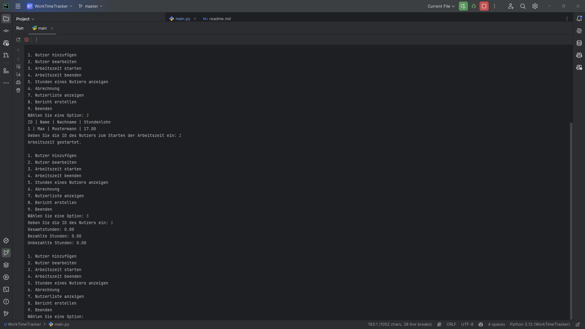
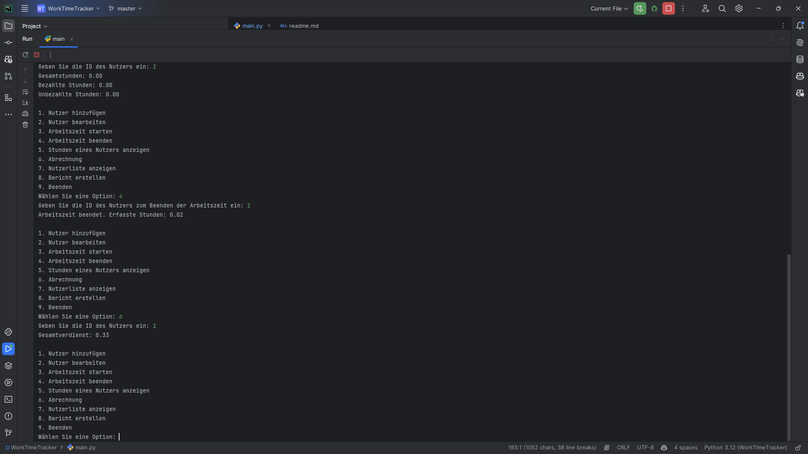
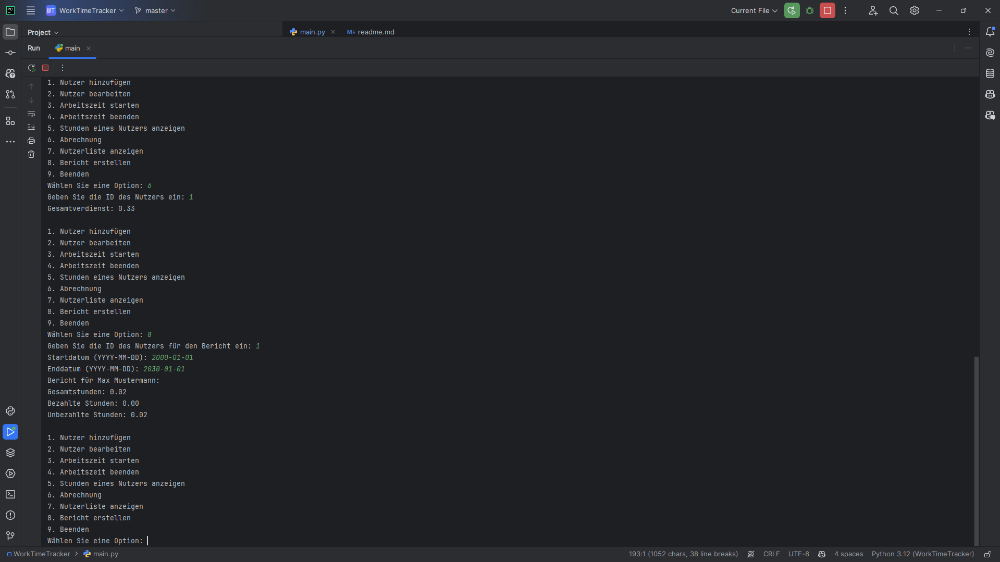

# Worktime Tracker
## Description
This is a simple solution to track the worketime of your employees. It is a application that can run on a central PC.

## Features
- Add new Users
- Edit Users
- Calculate the payout for each user based on the worktime and money per hour
- show all users and their worktime
- see the worktime of a specific user
- write a report about the worktime of a user in a specific time period
- start and stop the worktime of a user

## Installation
1. Clone the repository
2. Run `python main.py` to start the application

## Usage
- Add a new user: Select option "1" and enter the user details.

- Edit a user: Select option "2", choose a user from the list, and update their details.

- Start work time: Select option "3" and enter the user ID to start tracking their work time.

- Stop work time: Select option "4" and enter the user ID to stop tracking their work time.

- Show user hours: Select option "5" and enter the user ID to view their total work hours.

- Calculate payout: Select option "6" and enter the user ID to calculate their payout based on work hours.

- List all users: Select option "7" to display all users and their hourly wages.

- Generate report: Select option "8", enter the user ID and date range to create a work time report.

## Preview
  
  
  